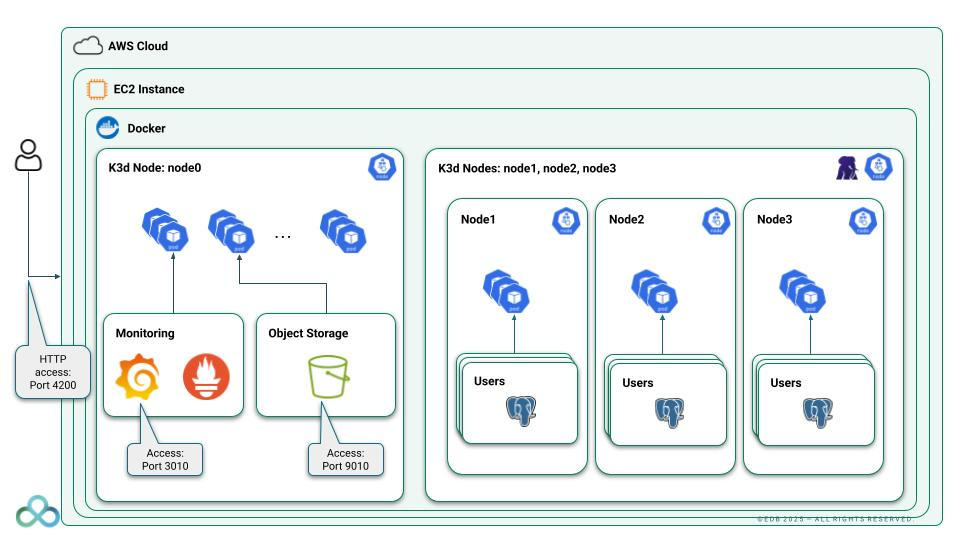
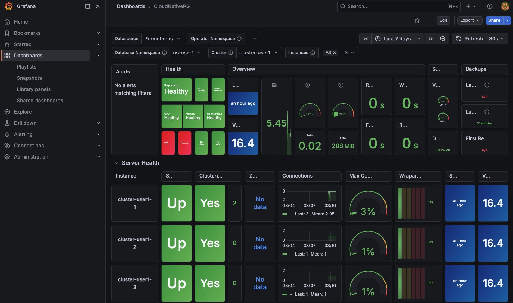
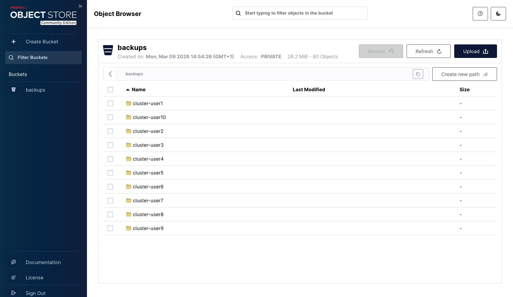

[](https://shields.io/)
[](https://GitHub.com/Naereen/StrapDown.js/graphs/commit-activity)


# Workshop: CloudNativePG Demo on EC2 (k3d + Docker)

This repository demonstrates how to run and operate a **PostgreSQL high-availability cluster on Kubernetes** using the **CloudNativePG / EDB Postgres for Kubernetes** operator.

The demo environment runs on a single AWS EC2 host and includes:

- **AWS EC2** + **Docker** + **k3d** (K3s in Docker): 1 server + 3 agents
- **CloudNativePG / EDB Postgres for Kubernetes** operator
- **MinIO** (S3-compatible object storage) for backups
- **Prometheus + Grafana** monitoring stack (with a CloudNativePG dashboard)
- **ttyd + tmux** web terminal for participants

It walks through common **Day-1 and Day-2 operations** for PostgreSQL on Kubernetes, and is built to run as a **multi-user** environment: one VM hosts `user1`..`userN`, each driving its own cluster in its own namespace.

---

## Architecture
```
EC2 Instance
│
├─ Docker
│
├─ k3d Kubernetes cluster (1 server + 3 agents)
│   │
│   ├─ CloudNativePG / EDB Postgres for Kubernetes Operator
│   ├─ MinIO (S3 Compatible Object Storage)
│   └─ Prometheus + Grafana
│
├─ ttyd web terminal (per-user shell access)
│
├─ User1 .. UserN
│   └─ PostgreSQL Cluster
│       ├─ Primary
│       ├─ Replica 1
│       └─ Replica 2
```


## User roles
- **Admin** — provisions the AWS infrastructure and installs the platform.
- **DBA** — manages PostgreSQL clusters with the CloudNativePG operator.

## Features demonstrated

| Who   | Feature                       | Description                                                      |
|-------|-------------------------------|------------------------------------------------------------------|
| Admin | Plugin & Operator Install     | Install `kubectl-cnpg` and deploy the **CloudNativePG operator** |
| DBA   | PostgreSQL Cluster Deployment | Create a highly available PostgreSQL cluster                     |
| DBA   | Insert Data                   | Demonstrate workload operations                                  |
| DBA   | Switchover / Failover         | Promote a replica manually, or on primary failure               |
| DBA   | Backup / Recovery             | Back up to **MinIO S3** and restore from backup                 |
| DBA   | Scaling                       | Scale replicas up and down                                       |
| DBA   | Rolling Updates               | Minor and major PostgreSQL upgrades                              |
| DBA   | Fencing / Hibernation         | Isolate or pause a cluster                                       |
| DBA   | Monitoring                    | Use Grafana to monitor cluster health                           |

---

## Prerequisites

On your local machine:
- **AWS CLI v2** ([install guide](https://docs.aws.amazon.com/cli/latest/userguide/getting-started-install.html)), authenticated:
  ```bash
  export AWS_ACCESS_KEY_ID="<your-key-id>"
  export AWS_SECRET_ACCESS_KEY="<your-secret-access-key>"
  export AWS_SESSION_TOKEN="<your-token>"      # if using temporary credentials
  ```
- `bash` and `ssh`.

## 1. Configure

All settings live in a single root [`config.sh`](./config.sh). At minimum, set
your IP so the security group lets you in:

```bash
REGION="<aws-region>"
INSTANCE_TYPE="<instance-type>"
TAG_NAME="<tag-name>"
KEY_NAME="<key-name>"
MY_CIDR="<my-cidr>"     # your public IP/32 — run `curl ipinfo.io/ip` to find it
```

> The full list of parameters (users, MinIO/Grafana credentials, ports, …) is
> documented in [`CONTRIBUTING.md`](./CONTRIBUTING.md).

## 2. Provision

Everything is driven by the single entry point [`provision.sh`](./provision.sh):

```bash
# Infrastructure only — then install the platform yourself (see step 3):
./provision.sh --infra-only

# Or full automation — infrastructure + platform installed via EC2 user-data:
./provision.sh --full --verbose

# Tear everything down (destroys all resources tagged $TAG_NAME):
./provision.sh --delete
```

`create.sh` provisions a `t2.2xlarge` (Amazon Linux 2023, 8 vCPU / 32 GiB) with
**4 gp3 disks** (root + `/mnt/disk1..3` for k3d storage) and a security group
opening ports **22** (SSH, restricted to `MY_CIDR`), **3010** (Grafana), **9010**
(MinIO console), and **4200** (ttyd). It also writes an SSH shortcut:

```bash
./infra/connect_ec2.sh
```

> If SSH times out, check that your current IP is still within `MY_CIDR`
> (`curl ipinfo.io/ip`) and update `config.sh`.

## 3. Install the platform (Admin)

If you used `--full`, this is already done automatically — skip to step 4.

Otherwise, SSH into the instance, clone the repo, and run the installer:

```bash
sudo dnf install -y git
git clone https://github.com/sergioenterprisedb/workshop-k8s-cnpg.git ~/workshop-k8s-cnpg
cd ~/workshop-k8s-cnpg/platform
./install.sh            # add --verbose to stream output
```

`install.sh` runs the four setup steps in order, fully automated:

1. **System** — docker, kubectl, helm, k3d, cmctl, and CLI tools
2. **Cluster** — k3d cluster, node labels, **Prometheus/Grafana** + **MinIO** (Helm)
3. **Terminal** — ttyd + tmux web terminal
4. **Users** — creates `user1`..`userN` and distributes the lab + kubeconfig

Then prepare CloudNativePG (admin-only, once):

```bash
cd ~/workshop-k8s-cnpg/lab/cnpg-hands-on
./01_install_plugin.sh
./02_install_operator.sh
./03_check_operator_installed.sh
./04_install_barman_plugin.sh
```

### Access
| Service       | URL                          | Credentials          |
|---------------|------------------------------|----------------------|
| Grafana       | `http://<EC2_IP>:3010`       | `admin` / `password` |
| MinIO console | `http://<EC2_IP>:9010`       | `admin` / `password` |
| Web terminal  | `http://<EC2_IP>:4200`       | `user[N]` / `password[N]` |




> Optional: import the [CloudNativePG Grafana dashboard](https://github.com/cloudnative-pg/grafana-dashboards/blob/main/charts/cluster/grafana-dashboard.json)
> via Grafana → Dashboards → New → Import (data source: Prometheus).

## 4. Run the scenarios (DBA)

Each participant connects to the **web terminal** (`http://<EC2_IP>:4200`) or via
SSH, logs in as `user[N]` / `password[N]`, and lands in `~/cnpg-hands-on` with
their kube context already set.

Run the numbered scripts in order:

```bash
./06_get_cluster_config_file.sh     # render the cluster manifest
./07_install_cluster.sh             # create the HA PostgreSQL cluster
./08_show_status.sh                 # watch cluster status
./09_insert_data.sh                 # insert demo data
./10_backup_cluster.sh              # backup to MinIO
./11_backup_describe.sh
./12_restore_cluster.sh             # restore from backup
./13_check_restore.sh
./14_promote.sh                     # switchover
./15_failover.sh                    # failover
./16_minor_upgrade.sh               # minor upgrade
./18_scale_out.sh                   # scale to 4 replicas
./19_scale_down.sh                  # scale to 2 replicas
./20_fencing.sh on|off              # fencing
./21_hibernation.sh on|off          # hibernation
./22_major_upgrade_by_copy.sh       # major upgrade (by copy)
./23_verify_data_migrated.sh
./24_major_upgrade_in_place.sh      # major upgrade (in place)
./25_verify_major_upgrade.sh
```

---

## Contributing

Repository structure, code conventions, the standard script template,
dependencies, and known issues are documented in
[`CONTRIBUTING.md`](./CONTRIBUTING.md). AI-assistant rules live in
[`AGENTS.md`](./AGENTS.md).
